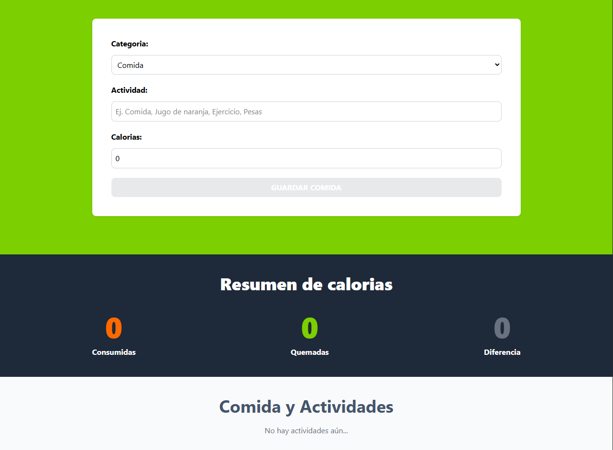

# 🥗 Calculadora de Calorías

Este es un proyecto desarrollado con **React + TypeScript + Vite**, usando **TailwindCSS** para los estilos, `useReducer`, `useState` y `useMemo` para una gestión eficiente del estado y `localStorage` para mantener la persistencia de datos.  
La aplicación permite registrar calorías consumidas y calorías quemadas a través de ejercicio, mostrando un resumen dinámico del balance calórico.

---

## 🧠 Lógica y Optimización

- ✅ Selección de categoría: Comida o Ejercicio
- ✅ Registro de nombre y cantidad de calorías
- ✅ Lista dinámica con todos los registros
- ✅ Cálculo total de calorías consumidas y quemadas
- ✅ Visualización de la diferencia entre calorías ingeridas y gastadas
- ✅ Estilos modernos y responsivos con **TailwindCSS**
- ✅ Optimización con `useMemo` y manejo de estado con `useReducer` y `useState`
- ✅ Persistencia de datos con `localStorage`
- ✅ Manejando comunicación entre componentes con `props`

## 🚀 Tecnologías Utilizadas

- ⚛ [React](https://reactjs.org/)
- ⚒️ [TypeScript](https://www.typescriptlang.org/)
- ⚡️ [Vite](https://vitejs.dev/)
- 🎨 [TailwindCSS](https://tailwindcss.com/)
- 🛡️ [Heroicons](https://heroicons.com/)
- React Hooks: `useState`, `useReducer`, `useMemo`

## 📸 Vista Previa



---

## 🛠️ Instalación y uso

Clonar el repositorio

```bash
git clone https://github.com/kevin-lovos-dev/calories-traker.git
```

Entrar al directorio

```bash
cd calories-traker
```

Instalar dependencias

```bash
npm install
```

Iniciar el servidor de desarrollo

```bash
npm run dev
```
